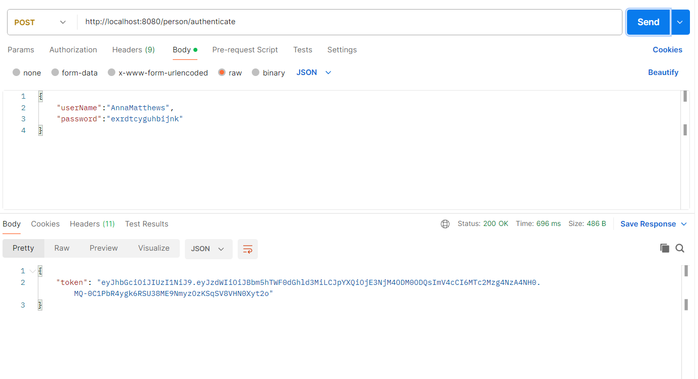
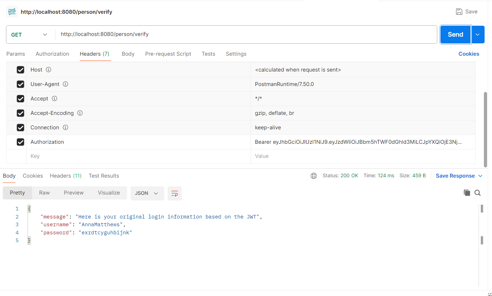

# 🔒 Spring Boot Security with JWT Authentication

## 📌 Overview

This project demonstrates how to implement **JWT-based authentication** in a Spring Boot application using **Spring Security**. It provides a secure way to authenticate users, issue JSON Web Tokens (JWT), and protect REST endpoints with stateless authentication.

---

## ✅ Features

- **User Authentication**: Secure login via `/person/authenticate` endpoint.
- **JWT Token Generation**: Issue JWT tokens upon successful authentication.
- **Protected Endpoints**: Access control for endpoints requiring valid JWT tokens.
- **In-Memory User Store**: Simple user management for demonstration purposes.
- **Spring Security Configuration**: Custom security settings for JWT authentication.

---

## 🛠 Technologies Used

- **Spring Boot**: 3.5.7
- **Spring Security**: 6.5.6
- **JWT**: JSON Web Tokens for stateless authentication
- **Maven**: Project management and build automation
- **Java**: 17

---
## 🖼️ Screenshots

### 1. Generating JWT Token:-

---

### 2. Verifying Identity with JWT Token:-

